# AME Defect & Regression Protocol

This document is the normative process for finding, verifying, and fixing
AME defects. It binds the AME project itself, but is publicly visible so
adopters can audit the discipline behind the standard.

## 0. Why this document exists

AME shipped v1.1 with a non-trivial set of latent defects. The reason was
not engineer skill. It was the absence of a discipline rule that requires
every defect claim to become an executable test before being acted on. The
WP#6 phantom-bug incident, where a follow-up plan was scoped around a
non-existent Kotlin chart-in-each() bug, is the canonical example.

This protocol fixes that.

## 1. Defect Lifecycle

```mermaid
stateDiagram-v2
    [*] --> Reported
    Reported --> Verified : failing test added to AuditedBugRegressionTest*
    Reported --> NotReal : passing test refutes the claim
    Verified --> Fixed : production code changed; failing test now passes
    Fixed --> LockedIn : test merged on main; CI guards forever
    NotReal --> LockedIn : test merged on main; phantom guard forever
    LockedIn --> [*]
```



Severity may be reassigned during verification. Audit-claimed severity is
a hypothesis; verified severity is the truth, recorded in
[`AUDIT_VERDICTS.md`](../../AUDIT_VERDICTS.md). Verified severity drives
fix order.

## 2. Verification Requirements

A defect cannot move from **Reported** to **Verified** without an
executable failing test in the appropriate test suite. NO defect is acted
on without a failing test. This is the discipline rule that prevents
phantom bugs.

The test must:

1. **Live in a permanent regression file** — the per-module
   `Audited*` test classes (`AuditedBugRegressionTest.kt` for Kotlin
   modules, `AuditedBugRegressionTests.swift` and
   `AuditedSwiftUIBugTests.swift` for Swift).
2. **Carry a docstring** with the standard fields:
   - Audit Bug #N (matching `AUDIT_VERDICTS.md`)
   - Spec section reference
   - Pre-fix expected outcome (FAIL or PASS, with explanation)
   - Post-fix expected outcome (PASS, with explanation of correct behavior)
3. **Fail today** in the case of a REAL bug — anyone running the suite
   confirms the defect immediately.
4. **Pass today** in the case of a NOT REAL claim — the test exists as a
   permanent guard against re-introduction of the false claim.

## 3. Conformance Impact Classification

During verification, every defect MUST be classified for its
serializer-output impact. The classification appears in
[`AUDIT_VERDICTS.md`](../../AUDIT_VERDICTS.md) under "Conformance impact":

- **none** — parser/serializer JSON unchanged. Examples: renderer-only
  bugs, theme bugs, form-state bugs.
- **regeneration required** — parser/serializer JSON changes; one or more
  `conformance/*.expected.json` files must be regenerated from the FIXED
  Kotlin parser before the PR can merge. The change does not invalidate
  any third-party implementation that already produces the corrected
  output; it just brings the conformance goldens in line.
- **breaking** — regeneration changes one or more existing
  `.expected.json` files in ways that any third-party AME implementation
  would also need to update for. PR MUST be labeled
  `BREAKING-CONFORMANCE`. PR description MUST list every affected case
  and the semantic difference.

Tooling-only or test-infra-only changes have no conformance impact.

## 4. `.expected.json` Regeneration Procedure

When a fix changes serializer output, follow these steps in order:

1. Apply the Kotlin fix; verify the audit regression test now passes.
2. Run [`conformance/regenerate-expected.sh`](../../conformance/regenerate-expected.sh)
   — it builds the Kotlin CLI and runs it over every `*.ame` file in the
   conformance directory, writing the new JSON to the corresponding
   `*.expected.json`.
3. Run `git diff conformance/` and inspect every changed file.
4. For each changed file, confirm the new output matches the corrected
   behavior (manual sanity check by the PR author and a reviewer).
5. If ANY existing `.expected.json` changed (not just newly added cases),
   apply the `BREAKING-CONFORMANCE` label and document each change in the
   PR description with the format:

   ```
   ## Conformance changes (BREAKING-CONFORMANCE)
   - 24-accordion-basic.expected.json: title field now resolves $path
     references; existing case unaffected because no $path in title.
   - 32-callout-info.expected.json: callout JSON now includes "color"
     when set; this case adds color=info, JSON gains "color":"info".
   ```

6. Cross-platform implementers (Swift, future Flutter/RN) must re-test
   against the new goldens in their own follow-up PR. The multi-runtime
   `check-parity.sh` (Bug 16 fix shipped in v1.2) ensures Swift failures
   are surfaced even when Kotlin already passes the new goldens.

## 5. Lock-in Requirements

A defect cannot be marked **Fixed** without all three:

1. The verifying test now passes (was failing before the fix).
2. The test is included in the permanent regression suite (not deleted
   after the fix lands).
3. Any required `.expected.json` regeneration is completed and reviewed.

A defect cannot be marked **LockedIn** without merging to main and seeing
the audit regression suite pass in CI on a subsequent unrelated PR. This
proves the test guards future changes.

## 6. Audit Discipline (the WP#6 phantom-bug rule)

When a comprehensive audit is performed (e.g., a security review, a
contractor's findings, an LLM-generated audit), every claim in the audit
MUST be converted to a Phase 1 verifying test before any Phase 2 fix work
is scoped or scheduled.

The motivating example is the WP#6 phantom: an audit claimed Kotlin's
chart-in-each() scope handling was broken. A follow-up plan was scoped
to "hot patch" this bug. No one wrote the test first. Had they written
the test, it would have passed (proving the claim was wrong), and a
phantom regression would not have been built into the next sprint.

This rule applies to:

- Findings from external security audits
- Findings from internal code review
- Findings from AI-assisted code review or static analysis tools
- Findings from any source claiming "X is broken in AME"

It does NOT apply to:

- User-reported bugs that already include a reproduction the team can
  convert to a test (the test still gets written; the discipline is just
  fast-tracked because the repro exists)

## 7. Cross-Platform Defect Handling (Kotlin-first)

When a defect exists in both Kotlin (ame-core / ame-compose) and Swift
(ame-swiftui), the Kotlin-first principle applies:

1. Fix Kotlin first. The Kotlin audit regression test that was failing
   now passes.
2. Regenerate `conformance/*.expected.json` if the fix changes serializer
   output (per §4). Kotlin owns the conformance goldens.
3. Mirror the fix to Swift. The Swift audit regression test that was
   failing now passes. Swift verifies its serializer output against the
   regenerated Kotlin goldens.
4. Both platforms' audit regression tests must pass before either fix is
   merged. A single PR may include both platforms' fixes; alternatively,
   the Swift PR depends on the Kotlin PR in the merge queue.

For Swift-only or Compose-only defects (e.g., a renderer bug that exists
only on one platform), the platform owning the bug fixes it directly.
The other platform's audit regression test (if any) confirms the bug
does not exist there.

## 8. Anti-Regression Discipline

- Audit regression tests MUST run on every PR via CI.
- A previously-passing audit regression test that now fails is a merge
  blocker. The PR author must either fix the regression or escalate.
- Removing or weakening an audit regression test requires explicit
  reviewer sign-off and a rationale in the PR description (e.g., "the
  underlying bug class no longer applies because the API was redesigned").
- Audit regression tests are first-class production code. They go through
  the same code review as any other change. Comments and test names
  matter.

## 9. Companion Tooling

- [`verify-bugs.sh`](../../verify-bugs.sh) — runs every audit regression
  suite and prints a summary. Used in CI and locally.
- [`conformance/regenerate-expected.sh`](../../conformance/regenerate-expected.sh)
  — regenerates `*.expected.json` from the current Kotlin parser. Used
  during the §4 procedure.
- [`AUDIT_VERDICTS.md`](../../AUDIT_VERDICTS.md) — the canonical record
  of every claim's verdict. Updated as part of every Phase 1 verification
  and every Phase 2 fix PR.
- [`RELEASE.md`](../../RELEASE.md) — the pre-release gate that depends on
  all of the above.

## 10. Updates to this document

This protocol is binding for the AME project itself. Changes require an
RFC issue per [`CONTRIBUTING.md`](../../CONTRIBUTING.md) and a major or
minor version bump on the next AME release. Substantive changes (new
verification requirements, new severity rules) are major; clarifications
are minor.
